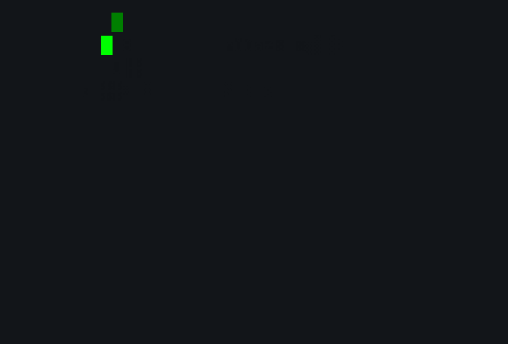

# MSOFv9 - Offensive Security, V9 📍

_Sources for tasks in Offensive Security, 9th edition_.

  

  <h6>F-117 ASCII art by Rafael Yedwab, Clark University. </h6>

## License

[`MSOF-9`](https://github.com/Neved4/MSOF-9) is licensed under the terms of the [MIT License].
   
See the [LICENSE](LICENSE) file for details.

[MIT License]: https://opensource.org/license/mit/
